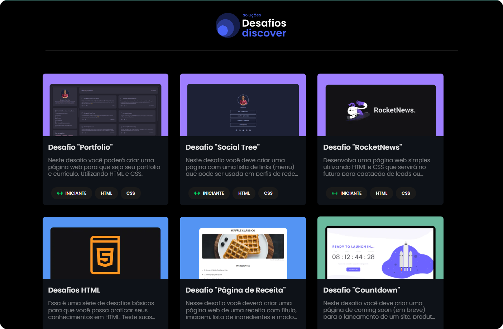

<h1 align="center">
  
</h1>

  

## 💻 Repositório

Este repositório tem como objetivo listar e demonstrar possíveis soluções para os desafios propostos na sessão de desafios da Trilha Discover disponibilizado gratuitamente na plataforma de cursos da [Rocketseat](https://app.rocketseat.com.br/discover/challenges). O foco principal é o exercício da triade básica da web: HTML, CSS e Javascript.

Clique [aqui](https://ernanej.github.io/rocketseat-discover-challenges/) para acessar.

---

  Desenvolvido com ♥ por  <a href="https://links.ernane.dev">Ernane Ferreira</a> 👋🏻

